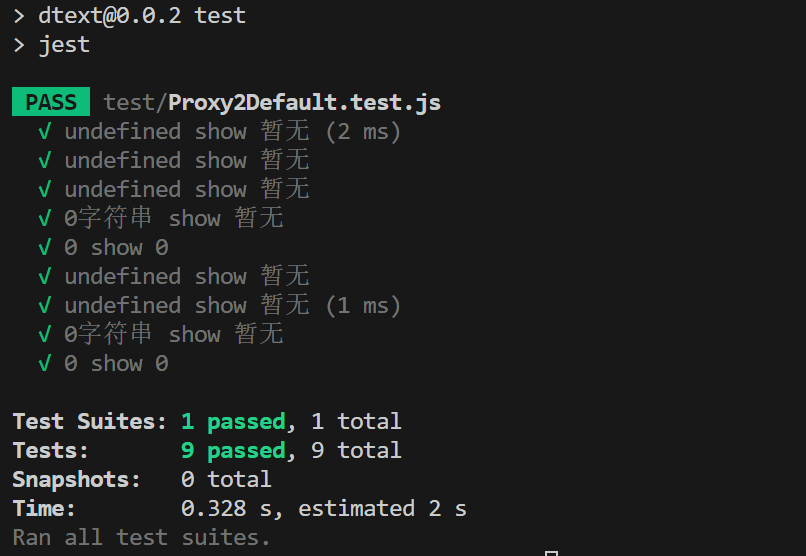

# dtext
方便的给对象，字符串或者数字一个默认值

## 背景
在前端项目中经常会遇到一些默认值处理的情况, 本项目可以让你方便的统一设置规则来进行默认值的处理，即灵活又统一方便修改。
## use
```
npm i dtext -S
```

```js
import Proxy2Default from 'dtext';
const proxy2Default = new Proxy2Default('暂无'});
proxy2Default.proxyObj(undefined);  //'暂无'
```

有时候你可能需要一些比较特殊的处理规则，比如你哪些特殊的值需要处理成为默认值通过includes，哪些特殊的值0， false不需要处理为默认值通过excludes

```js
const proxy2Default = new Proxy2Default('暂无', { includes: ['0'], excludes: [0] });
const obj = {msg: '', id: 0, value: '0'};
proxy2Default.proxyObj(obj, {key: 'id'}); // 0 excludes: [0]
proxy2Default.proxyObj(obj, {key: 'msg'}); // '暂无'
proxy2Default.proxyObj(obj, {key: 'value'}); // '暂无' includes: ['0']

```
Proxy2Default参数说明

|参数|说明|类型|默认值|
|---|---|---|---|
|第一个参数|第一个参数为字符串或者函数，如果是函数的返回值为默认值|string\|() => string|无|
|options|这里是一个可选对象|object|无|

options的参数说明
|参数|说明|类型|默认值|
|---|---|---|---|
|includes|里面的值会被替换为默认值|string\|number[]|无|
|excludes|这里的值不会被替换为默认值，常见0等你不想被替换为默认值的情况|string\|number[]|无|

proxyObj中参数说明
```js
proxyObj(
  obj: any,
  options?: { 
    key?: string, 
    defaultText?: string|(() => string), 
    includes?: (string|number)[],
    excludes?: (string|number)[],
  }
)
```
proxyObj中的参数优先级高 会覆盖类中的参数！

## 单元测试
 
